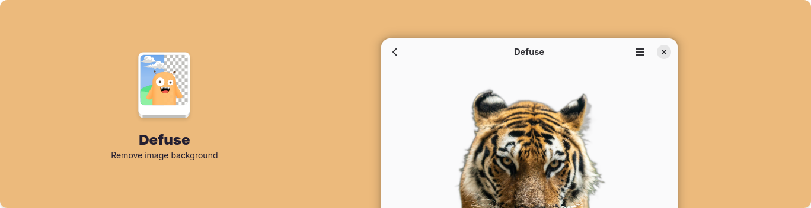

# Defuse

**Remove image backgrounds locally**

## Description

Defuse is a local background removal tool written in Python using GTK4 and Libadwaita. Processing is performed using the ISNet-general model through ONNX Runtime.

## Features

- Images are processed locally
- Uses WebGPU acceleration on x86_64 systems

## Install

## Development

You can clone this project and run it using [Gnome Builder](https://apps.gnome.org/Builder/). The Python libraries used in this project are defined inside [requirements.txt](./requirements.txt), which you may install if you want editor completions.

## Credits

Background removal implementation is inspired by [rembg](https://github.com/danielgatis/rembg).

Background removal model is [ISNet-general](https://github.com/xuebinqin/DIS).

## Other apps by me

- [**Brief**](https://github.com/shonebinu/Brief) - Browse command-line cheatsheets
- [**Lipi**](https://github.com/shonebinu/Lipi) - Discover and install online fonts
- [**Exchange**](https://github.com/shonebinu/Exchange) - Convert between XML and Blueprint
